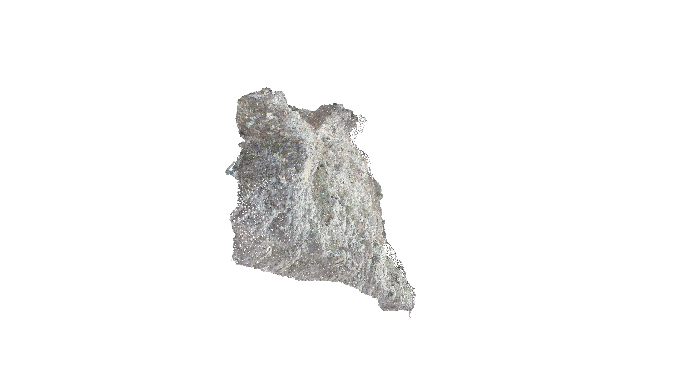
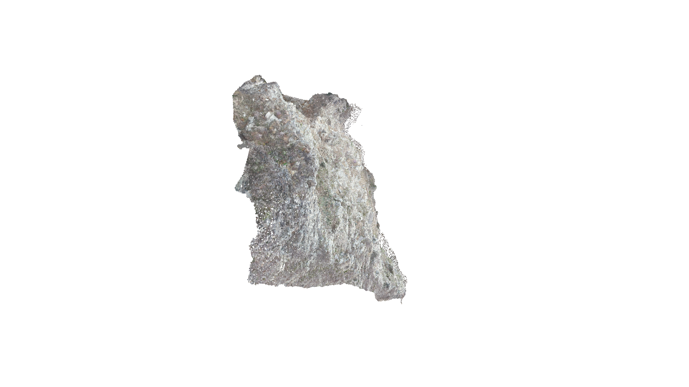
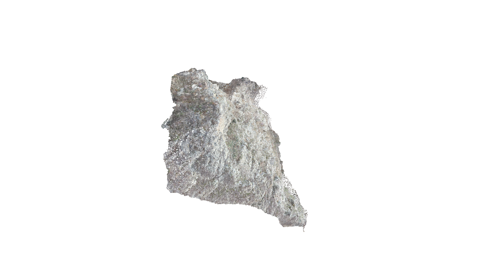

# Rock Wall Structural Information Extraction Toolkit

A research-oriented Python toolkit for extracting, representing, and visualizing structural information from complex rock-wall digital geological models. The project focuses on turning dense 3D mesh/point-cloud data into interpretable scanline profiles, detecting overhanging or discontinuous geometric structures, reconstructing candidate unstable blocks, and estimating spatial metrics such as volume and density.

> This repository is a sanitized open-source version of a graduate research prototype. Site names, institution names, author identifiers, and local data paths have been removed or replaced with generic examples.

## Highlights

- Arc-based digital scanline layout for curved rock-wall baselines.
- Mesh slicing and 3D-to-2D profile projection.
- Graph/path-based ordering of fragmented section line segments.
- Orthogonal vector field analysis for overhanging-feature recognition.
- Multi-profile feature grouping, clustering, and 3D reconstruction support.
- Voxel-based volume estimation and KDE-style density visualization.
- Utilities for 3MX/OBJ/PLY/LAS workflows, PyVista/Open3D visualization, and publication-style plotting.

## Project Showcase

Visual project pages are available in two languages: [English](docs/showcase.en.html) / [中文](docs/showcase.zh-CN.html). They summarize the digital scanline framework, current results, application outputs, progress, and roadmap.

## Visual Examples

The images below are exported visualization snapshots from the sanitized research workflow.







## Repository Layout

```text
.
├── configs/                  # Example configs; replace with your own paths and model parameters
├── data/examples/            # Tiny placeholders and data-format notes only
├── docs/                     # Method description, usage guide, script inventory, privacy notes
├── polt/                     # Plotting helper scripts kept from the original prototype
├── outputs/                  # Ignored runtime output directory
├── *.py                      # Research scripts and processing modules
├── requirements.txt
└── README.md
```

## Quick Start

```bash
python -m venv .venv
.venv\Scripts\activate
pip install -r requirements.txt
```

Prepare your own data and configuration:

1. Copy `configs/paths.example.json` to `configs/paths.local.json`.
2. Copy or generate `configs/arc_config.example.json` as your scanline arc configuration.
3. Put private meshes/point clouds outside Git, or under `data/private/` which is ignored.
4. Run scripts according to `docs/usage_guide.md` and `docs/script_inventory.md`.

## Typical Workflow

1. Fit or define the curved baseline of the rock wall.
2. Generate scanline planes and extract mesh-section line segments.
3. Order fragmented segments into profile paths.
4. Compute local normals and detect overhanging profile features.
5. Aggregate features across scanlines and cluster candidate structural units.
6. Reconstruct 3D line/face/voxel representations.
7. Visualize structural units, density patterns, and volume metrics.

## Main Entry Scripts

- `2d_feat.py`: point-cloud filtering, arc fitting, and 2D baseline/profile analysis.
- `2d_ceshi.py`: simple arc-grid visualization over a point cloud.
- `slice_generator.py`: generate mesh slice intersections along scanline positions.
- `Multi_profit.py`: multi-profile slicing and feature grouping workflow.
- `generate_normals.py`: detailed normal/vector-field computation and plotting utilities.
- `line_face_extraction.py`: collect slice-line to mesh-face correspondence.
- `structural.py`: face clustering, voxelization, and structural volume workflow.
- `voxel_ceshi.py`, `kde.py`, `point_dbscan.py`: voxel, density, and cluster visualization.

See `docs/script_inventory.md` for a fuller map.

## Data and Privacy

Large source data such as raw 3D meshes, LAS/PLY files, 3MX scene folders, intermediate pickle files, and private case data are intentionally excluded from Git. The current `.gitignore` prevents accidental upload of these files.

Before publishing, read `docs/privacy_checklist.md` once more. This repository is prepared under the Apache-2.0 license.

## Citation

If you use the methodology, please cite this repository and the related thesis/paper once a public citation format is available. See `CITATION.cff` for the repository citation metadata. The repository description intentionally omits personal and site-specific identifiers.


